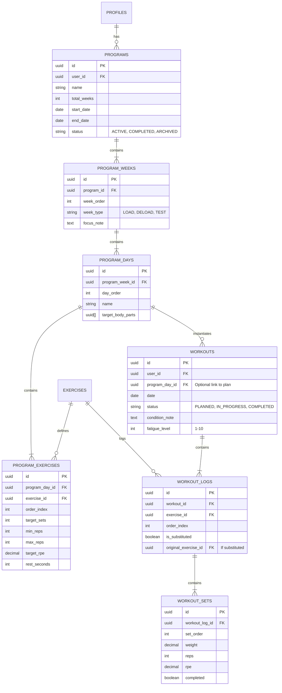

# PRD: Health OS (`/health`)

## 0. 한 줄 정의
> **Health OS는 ‘운동을 할지 말지, 어떻게 할지’를 대신 판단해주는 개인 전용 헬스 기록·코칭 시스템이다.**

---

## 1. 라우팅 구조 설계 (`/health`)

앱의 라우팅 구조는 `/health`를 기점으로 다음과 같이 구성된다. 온보딩 여부에 따라 초기 진입 화면이 달라지며, "오늘의 행동"을 결정하는 것이 핵심 UX이다.

```
/health
├─ /onboarding          # 초기 진입 시 (필수 정보 미입력 시)
│  ├─ /nickname         # 닉네임 설정 (AI 코칭 주어)
│  ├─ /baseline
│  │  ├─ /lifts         # 3대 운동 수행 능력 (벤치, 스쿼트, 데드 등)
│  │  └─ /inbody        # 인바디 정보 (체중, 골격근량 등)
│  ├─ /profile          # 신체/생활 정보 (키, 수면시간 등)
│  ├─ /goal             # 목표 설정 (근력, 다이어트 등) - 필수
│  └─ /schedule         # 운동 가능 요일/시간 - 필수
│
├─ /dashboard           # 메인 대시보드
│  ├─ /today            # 오늘의 AI 판단 & 수행 가이드 (Home)
│  └─ /summary          # 주간/월간 성취 요약
│
├─ /workout             # 운동 수행
│  ├─ /log              # 실시간 운동 기록 입력
│  └─ /history          # 과거 운동 기록 조회
│
├─ /goals               # 목표 관리
│  ├─ /current          # 진행 중인 목표 확인 및 수정
│  └─ /history          # 완료/포기한 목표 이력
│
├─ /settings            # 설정
│  ├─ /profile          # 사용자 정보 수정
│  └─ /preferences      # 선호도 설정

```

### 라우팅 원칙
1. **/health 진입 시 로직**:
   - 온보딩 완료 ❌ → `/health/onboarding`으로 리다이렉트
   - 온보딩 완료 ⭕️ → `/health/dashboard/today`로 이동
2. **First Screen Policy**:
   - 사용자가 앱을 켰을 때 가장 먼저 "오늘 무엇을 해야 하는가?"를 명확히 제시한다.

---

## 2. DB 스키마 설계

핵심 데이터 위주로 설계하며, 판단에 불필요한 노이즈 데이터는 배제한다.

### 2.1 User
기본 사용자 정보. AI 코칭의 개인화를 위한 닉네임이 핵심이다.

```typescript
type User = {
  id: string;            // UUID
  email: string;         // 로그인 ID
  passwordHash: string;  // 암호화된 비밀번호
  nickname: string;      // 필수, 코칭 메시지의 호칭으로 사용
  createdAt: Date;
};
```

### 2.2 HealthProfile
코칭 알고리즘의 보정값으로 사용되는 건강/생활 데이터. 정확성보다는 판단의 근거로 활용된다.

```typescript
type HealthProfile = {
  userId: string;
  height?: number;          // 키 (cm)
  sleepAvg?: number;        // 평균 수면 시간 (시간)
  workoutPerWeek?: number;  // 주당 목표 운동 횟수
  injuryNotes?: string;     // 부상 특이사항 (프롬프트 컨텍스트용)
  preferences?: string[];   // 선호 운동/스타일 등
  updatedAt: Date;
};
```

### 2.3 Workout
운동 수행 기록. 정확한 기록을 지향하며 영상 등의 부가 데이터는 MVP에서 제외한다.

```typescript
type Workout = {
  id: string;
  userId: string;
  date: Date;               // 운동 날짜
  exercises: Exercise[];    // 수행한 운동 목록 (JSON)
  rpeAvg?: number;          // 평균 자각도 (1-10)
  conditionNote?: string;   // 당일 컨디션 메모
};

type Exercise = {
  name: string;   // 운동 종목명
  sets: number;   // 세트 수
  reps: number;   // 반복 횟수
  weight: number; // 중량 (kg)
  rpe?: number;   // 세트별 RPE (선택)
};
```

### 2.4 Inbody
체성분 데이터. 최근 값의 변화 추이를 판단에 적극 활용한다.

```typescript
type Inbody = {
  id: string;
  userId: string;
  date: Date;
  weight: number;           // 체중 (kg) - 필수
  skeletalMuscle?: number;  // 골격근량 (kg)
  bodyFatRate?: number;     // 체지방률 (%)
  score?: number;           // 인바디 점수
};
```

### 2.5 Goal
사용자의 목표. 목표 유형에 따라 프로그램의 방향성이 결정된다.

```typescript
type Goal = {
  id: string;
  userId: string;
  type: "strength" | "weight" | "bodyfat"; // 근력, 체중, 습관, 체지방
  targetValue: number;   // 목표 수치
  unit: string;          // 단위 (kg, %, 회 등)
  priority: number;      // 우선순위 (1이 최상위) - 판단 충돌 시 기준
  startDate: Date;
  isActive: boolean;     // 현재 진행 중 여부
};
```

---

## 3. AI 프롬프트 구조 (코칭 판단 로직)

### 3.1 입력 컨텍스트 (Input)
AI에게 전달되는 현재 사용자의 상태 정보 스냅샷.

```json
{
  "user": {
    "nickname": "민성님",
    "profile": { ... }
  },
  "recentWorkouts": [ ... ], // 최근 운동 기록 배열
  "latestInbody": { ... },   // 가장 최근 인바디
  "activeGoals": [ ... ],    // 활성화된 목표 리스트
  "schedule": { ... },       // 운동 가능 스케줄
  "todayCondition": {        // 당일 입력받는 컨디션 (선택적)
    "sleep": 5,
    "fatigue": "high"
  }
}
```

#### 3.3 개인화 프로그램 및 세션 관리 (Added v2026.02.04)

> 2026.02.04 기준 추가된 기능 명세입니다. 사용자의 목표와 상태에 맞춰 N주 단위의 운동 프로그램을 생성하고, 매일매일 수행할 세션을 자동으로 주입 및 관리하는 기능을 정의합니다.

#### 1) 도메인 모델 정의

*   **Program (프로그램)**: N주짜리 전체 계획 (예: "Powerbuilding Phase 1 - 8 Weeks"). 사용자의 목표에 맞춰 생성됩니다.
*   **Program Week (주차)**: 프로그램의 하위 단위 (1주차, 2주차...). 각 주차는 'Loading(일반)', 'Deload(디로딩)', 'Test(측정)' 등의 타입을 가집니다.
*   **Program Day (요일/세션 템플릿)**: 하루에 수행할 운동 목록의 계획입니다. (예: "Day 1 - 하체 중심").
*   **Program Exercise (계획 운동)**: 해당 세션에서 수행해야 할 운동, 목표 세트, Reps, RPE 등이 정의됩니다.
*   **Workout Session (실제 수행 세션)**: 특정 날짜에 할당된 실제 운동 기록 단위입니다. 계획(Program Day)과 연결되지만, 실제 수행 일자는 다를 수 있습니다.
*   **Workout Log (운동 기록)**: 세션 내에서 실제로 수행한 운동, 세트, 무게, 횟수 등의 로그입니다.

#### 2) 데이터베이스 설계 (ERD 제안)

기존 `workouts` 테이블을 확장하고, 프로그램 관리를 위한 신규 테이블을 추가합니다.



#### 3) 주요 API 설계

| Method | Endpoint | Description |
| :--- | :--- | :--- |
| **POST** | `/programs/generate` | 사용자 프로필/목표 기반 N주 프로그램 생성 |
| **GET** | `/programs/current` | 현재 활성화된 프로그램 및 진행 상황 조회 |
| **POST** | `/workouts/generate-today` | 오늘 날짜의 예정된 운동 세션(Workout) 생성 (Idempotent) |
| **GET** | `/workouts/today` | 오늘 수행해야 할(또는 수행 중인) 세션 상세 조회 |
| **POST** | `/workouts/:id/complete` | 세션 완료 처리 및 다음 프로그램 갱신(Progression Rule 적용) |
| **POST** | `/workouts/logs/:logId/sets` | 세트 기록 추가/수정 |

**서버 액션 구조 (Next.js)**:
*   `generateProgram(userId, preferences)`: 템플릿 기반 프로그램 데이터 생성
*   `getTodayWorkout(userId)`: `workouts` 테이블 조회 -> 없으면 `programs` 확인 후 생성 -> 없으면 빈 세션 반환
*   `saveWorkoutSet(logId, setData)`: 실시간 세트 저장
*   `completeWorkout(workoutId)`: 완료 처리 및 통계 업데이트

#### 4) 화면 및 UX 플로우

1.  **온보딩/설정**:
    *   사용자가 목표(근비대/스트렝스), 주당 운동 횟수(3/4/5일), 시작일을 입력하면 프로그램이 생성됩니다.
2.  **홈 (투데이)**:
    *   "오늘의 운동 시작하기" 버튼 클릭 시, 해당 날짜의 `Program Day`를 불러와 `Workout` 인스턴스를 생성합니다.
    *   휴식일인 경우 "오늘은 휴식일입니다" 메시지와 함께 스트레칭 등을 추천합니다.
3.  **운동 수행 (In-Session)**:
    *   계획된 운동 목록이 표시됩니다. (예: 스쿼트 5세트, 5회, RPE 8)
    *   사용자는 각 세트 수행 후 무게/횟수를 체크합니다.
    *   특정 운동을 할 수 없는 경우 "대체(Substitute)" 버튼을 눌러 유사 부위 운동으로 교체합니다.
4.  **완료 및 피드백**:
    *   운동 완료 시, 총 볼륨과 달성률을 보여줍니다.
    *   RPE와 피로도 입력을 받아 다음 주차 중량을 위한 데이터로 활용합니다.

#### 5) 증량 로직 (Progression Rule Engine)

*   **위치**: Server Side (Completion Action 내에서 실행)
*   **로직 예시**:
    *   `if (실제 RPE < 목표 RPE - 1) && (성공)` -> 다음 세션 무게 +2.5kg
    *   `if (실제 RPE > 목표 RPE + 1) || (실패)` -> 다음 세션 무게 동결 또는 -5%
    *   `Week 4 (Deload)` -> 강제로 전체 볼륨 50% 수준으로 생성

#### 6) 작업 분해 (TODO)

1.  [DB] 상기 ERD 기반 테이블 마이그레이션 (`program_*`, `workout_*` tables)
2.  [Server] 프로그램 생성 로직 구현 (하드코딩된 템플릿 -> DB 주입)
3.  [Server] `getTodayWorkout` 로직 구현 (Program Day -> Workout 변환)
4.  [UI] `WorkoutSession` 컴포넌트 리팩토링 (정규화된 데이터 구조 지원)
5.  [UI] 프로그램 설정/생성 페이지 구현 (`/health/program/setup`)
6.  [Server] 증량 규칙(Progression) 간단 버전 구현

---

### 3.2 판단 단계 (Reasoning Steps)
AI는 다음 단계를 거쳐 최종 제안을 도출한다.

1. **회복 상태 평가**: 수면 시간, 피로도, 최근 운동 빈도, 누적 RPE 등을 종합 분석.
2. **목표 우선순위 반영**: '근력 증진' vs '체중 감량' vs '습관 형성' 중 최우선 목표에 가중치 부여.
3. **일정 현실성 체크**: 오늘 운동 가능한 시간과 강제성 여부(스케줄) 확인.
4. **최종 판단 도출**: 운동 여부(Go/No-go), 적정 강도, 추천 종목 결정.

### 3.3 출력 포맷 (Output Schema) - 강제
AI의 출력은 다음 JSON 스키마를 엄격히 따라야 한다. 애매한 표현은 허용하지 않는다.

```json
{
  "decision": "rest | train | light_train",
  "reason": "판단의 명확한 근거 (한 문장)",
  "recommendation": {
    "focus": "하체 | 상체 | 전신 | 휴식 | 유산소",
    "intensity": "low | medium | high"
  },
  "message": "사용자(닉네임)에게 건네는 자연스러운 코칭/동기부여 멘트"
}
```
* **원칙**: "쉬세요", "하세요", "줄이세요"와 같이 명확한 지침을 제공한다.

---

## 4. MVP 기능 범위 (Scope)

### ✅ 반드시 포함 (MVP)
* **계정**: 회원가입, 로그인
* **온보딩**: 닉네임 설정, 기초 체력/신체 정보 입력
* **설정**: 목표 설정, 운동 스케줄 설정
* **핵심 기능**:
  * 운동 기록 (Workout Logging)
  * 인바디 기록
  * **오늘의 AI 판단 (Dashboard)**
  * 주간 활동 요약

### ❌ 제외 (Initial Phase)
* 자세 분석 및 코칭
* 영상 업로드/재생
* 소셜 기능 (커뮤니티, 친구, 공유)
* 랭킹 시스템
* 정밀 영양 관리 (칼로리 계산, 식단 기록)
* 웨어러블 디바이스 연동
* 푸시 알림

> **제외 사유**: "오늘 운동을 할지 말지"를 결정하는 의사결정의 품질과 직접적인 관련이 적거나, 사용자에게 정보 입력의 피로도(Noise)를 높이는 기능은 배제한다.

---

## 5. 성공 기준 (Success Metrics)

"혼자 쓰는 전용 시스템"으로서의 가치를 증명하는 지표.

* **Decision Time**: 사용자가 앱을 켜고 "오늘 할 일"을 확정하기까지 걸리는 시간 감소.
* **Psychological Safety**: 운동을 쉬는 날에도 AI의 판단에 따라 "죄책감 없이" 휴식을 취하는 경험.
* **Accuracy Improvement**: 기록이 누적될수록 코칭의 정확도와 사용자 만족도가 상승하는 구조.

---

## 6. 핵심 철학

> **"Health OS는 나를 더 몰아붙이지 않는다. 대신, 나 대신 냉정해진다."**
